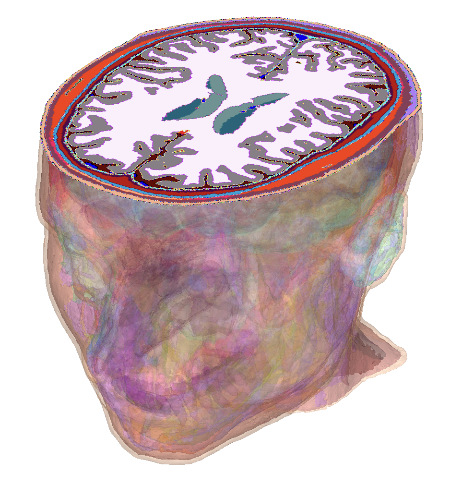

# Human Head Viewer

Interactive human head model in the browser. 



*Supports mechanical, thermal and electromagnetic tissue property visualization.*

## Getting Started

### Prerequisites

- Node.js (v14 or higher)
- npm

### Installation

```bash
npm install
```

### Running the Viewer

```bash
npm run dev
```

Open your browser to the URL shown in the terminal.

## References

- [Human head model](https://itis.swiss/virtual-population/regional-human-models/mida-model/) (subject to [MIDA license terms](https://itis.swiss/assets/Downloads/VirtualPopulation/License_Agreements/LicenseAgreementMIDA_2024.pdf))

- [IT'IS Tissue Properties Database](https://itis.swiss/virtual-population/tissue-properties/database/)
